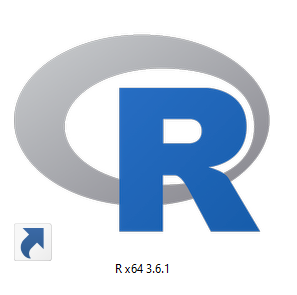
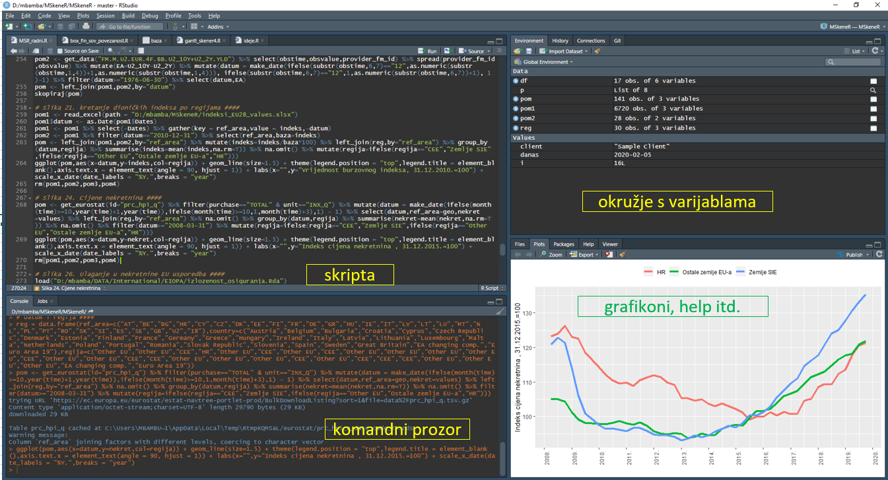
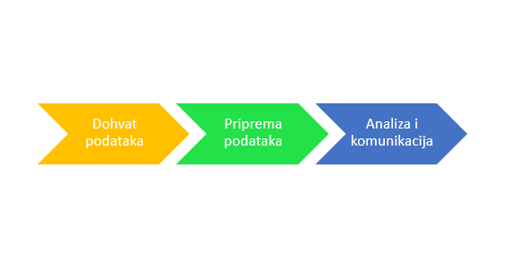
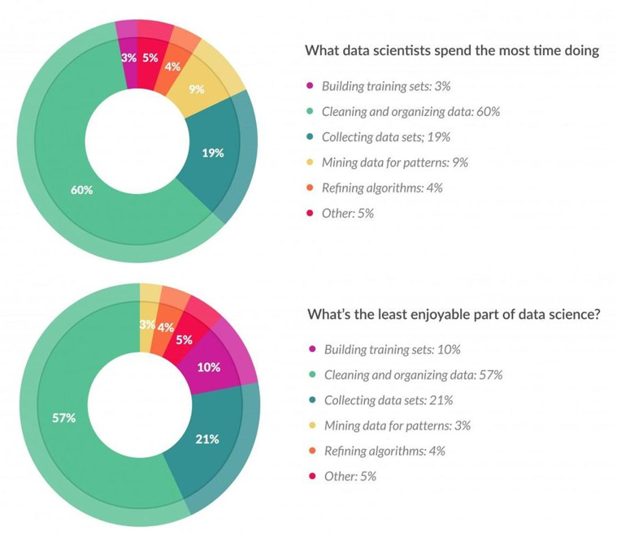
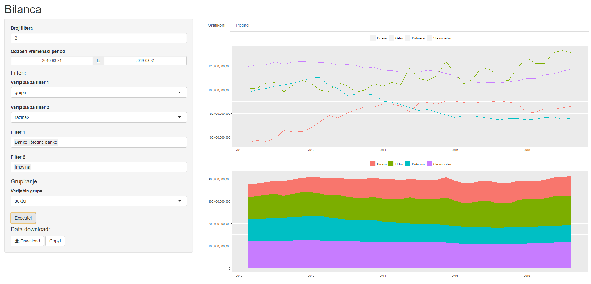
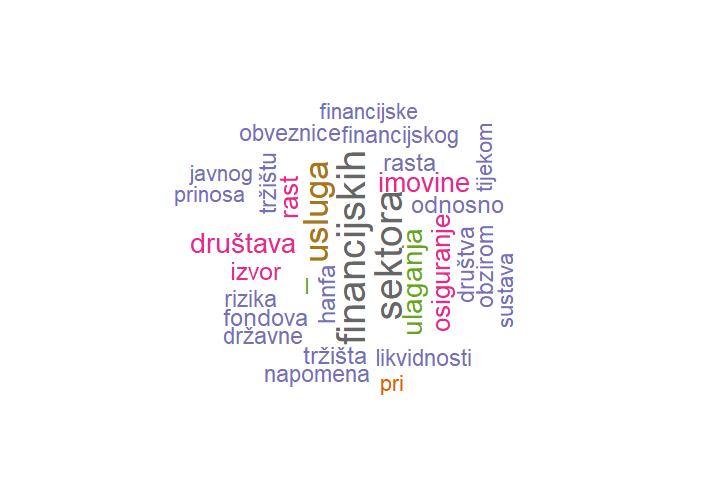

## Sadržaj

#### 1. Općenito o R-u
#### 2. Rstudio
#### 3. Paketi i Tidyverse
#### 4. Data science proccess
#### 5. Dohvat podataka
#### 6. Priprema podataka
#### 7. Analiza i komunikacija

## 1. Općenito o R-u

**NAPOMENA! Sve što ću danas pričati vrijedi i za druge programske jezike i mislim da se sve ove funkcionalnosti mogu naći i u drugim jezicima, R je samo moj program odabira na kojem sam se učio raditi analitiku, cilj  ove prezentacije nije R kao jezik nego stvari koje se mogu općenito raditi u programskim jezicima. U trenutku pisanja R je prema [TIOBE indeksu](https://www.tiobe.com/tiobe-index/) 13. na ljestvici najpopularnijih jezika.**

R je besplatan programski jezik koji su u 90-ima osmislili Ross Ihaka i Robert Gentleman iz Novog Zelanda [link na wikipedia stranicu](https://en.wikipedia.org/wiki/R_(programming_language)). Ono što je važno napomenuti da je R **open source jezik** i kao takav je **besplatan** i stalno se razvija jer ima vrlo aktivnu zajednicu.

  

***

R se može besplatno skinuti i instalirati [ovdje](https://cran.r-project.org/bin/windows/base/). Instalacija je vrlo jednostavna (next -> next -> next). Kada se instalira, onda se na desktopu stvori ikoan preko koje se pokreće:



Kada se RGui aplikacija pokrene, sučelje izgleda ovako:


## 2. Rstudio

Većina ljudi kada govori o R-u, zapravo misli na Rstudio sučelje koje se može skinuti i instalirati [ovdje](https://rstudio.com/). Rstudio koje privatna kompanija koja za sebe kaže sljedeće: 

> RStudio's mission is to create free and open-source software for data science, scientific research, and technical communication. We do this to enhance the production and consumption of knowledge by everyone, regardless of economic means, and to facilitate collaboration and reproducible research, both of which are critical to the integrity and efficacy of work in science, education, government, and industry.

Nakon što instaliramo i pokrenemo Rstudio, sučelje izgleda ovako:



**Mrkli mrak, zar ne? :)**

Što se funkcionalnosti, sve što može Rstudio, može i RGui, no ono u čemu Rstudio prednjači je korisničko iskustvo. Neke od cool funkcionalnosti koje su dostupne u Rstudiju su:

* tamna pozadina :)
* povezivanje s Github-om (o tome više kasnije)
* Viewer
* Rmarkdown
* Shiny
* pomoć pri pisanju (različite boje za različite objekte, zatvaranje zagrada, autocorrect, sugeriranje riječi, itd...)

## 3. Paketi i Tidyverse

Ono što R i slične programe čini izuzetno moćnima je sposobnost podizanja parametrizacije na nekoliko razina apstrakcije.


Najpoznatiji "svemir" aplikacija koje su međusobno konzistentne i međusobno "komuniciraju" je **Tidyverse** koji razvija upravo Rstudio ekipa:


Popratni materijali vezano za sve pakete u sklopu Tydiversea mogu se pronaći [ovdje](https://rstudio.com/products/rpackages/), pri čemu za ove najvažnije pakete postoje fora [šalabahteri](https://rstudio.com/resources/cheatsheets/). Osim šalabahtera postoje i [online knjige](https://rstudio.com/resources/books/), te čak i [webinari](https://resources.rstudio.com/).

Naravno da ovo nije cijeli "svemir" R paketa, koji trenutno broji preko [15000 paketa](https://cran.r-project.org/web/checks/check_summary.html). 

## 4. Data science proccess

Proces svake kvantitativne analize se sastoji od 3 ključna dijela i kod sva 3 dijela R nudi vrhunska rješenja.



## 5. Povezivanje s izvorima podataka

### 5.1. ECB

ECB ima jako dobro osmišljen sustav [skladišta podataka](http://sdw.ecb.europa.eu/browse.do?node=9689727) gdje je svaki podatak jednoznačno određen sa jedinstvenim kodom - primjer CLIFS indikatora za HR [link](http://sdw.ecb.europa.eu/browseSelection.do?node=9693347):

> CLIFS.M.HR._Z.4F.EC.CLIFS_CI.IDX

```{r }
library(ecb)
library(tidyverse)
library(lubridate)
pom <- get_data("CLIFS.M.._Z.4F.EC.CLIFS_CI.IDX") %>% select(ref_area,obstime,obsvalue) %>% mutate(datum = make_date(ifelse(substr(obstime,6,7)=="12",as.numeric(substr(obstime,1,4))+1,as.numeric(substr(obstime,1,4))), ifelse(substr(obstime,6,7)=="12",1,as.numeric(substr(obstime,6,7))+1), 1)-1) 
ggplot(pom,aes(x=datum,y=obsvalue)) + geom_line() + facet_wrap(~ref_area)

```

```{r}
reg = data.frame(ref_area=c("AT","BE","BG","HR","CY","CZ","DK","EE","FI","FR","DE","GR","HU","IE","IT","LV","LT","LU","MT","NL","PL","PT","RO","SK","SI","ES","SE","GB","U2","I8"),country=c("Austria","Belgium","Bulgaria","Croatia","Cyprus","Czech Republic","Denmark","Estonia","Finland","France","Germany","Greece","Hungary","Ireland","Italy","Latvia","Lithuania","Luxembourg","Malta","Netherlands","Poland","Portugal","Romania","Slovak Republic","Slovenia","Spain","Sweden","Great Britain","EA changing comp.","Euro Area 19"),regija=c("Other EU","Other EU","CEE","HR","Other EU","CEE","Other EU","CEE","Other EU","Other EU","Other EU","Other EU","CEE","Other EU","Other EU","CEE","CEE","Other EU","Other EU","Other EU","CEE","Other EU","CEE","CEE","CEE","Other EU","Other EU","Other EU","EA changing comp.","Euro Area 19"))
pom <- pom %>% left_join(reg,by="ref_area") %>% group_by(datum,regija) %>% summarise(clifs=mean(obsvalue,na.rm=T))
ggplot(pom,aes(x=datum,y=clifs,col=regija)) + geom_line() + theme(legend.title = element_blank(),legend.position = "top") + labs(x="",y="CLIFS indeks")
rm(pom)
```

### 5.2. Eurostat

Eurostat isto ima svoj paket za pristup R-a na njihovo [skladište podataka](https://ec.europa.eu/eurostat/data/database). Kod njih je pristup malo drukčije organiziran, tako da najprije treba specificirati tablicu na koju se spajamo - [primjer za BDP](https://appsso.eurostat.ec.europa.eu/nui/show.do?dataset=namq_10_gdp&lang=en).

```{r, message=F}
library(eurostat)
# 1.1. YOY stopa rasta BDP-a
pom1 <- get_eurostat(id="namq_10_gdp") %>% filter(geo=="HR" & na_item=="B1GQ" & s_adj=="NSA" & unit=="CLV10_MNAC") %>% select(time,bdp=values) %>% arrange(time) %>% as.data.frame()

# 1.2. Doprinos - potrošnja kućanstava
pom2 <- get_eurostat(id="namq_10_gdp") %>% filter(geo=="HR" & na_item=="P31_S14_S15" & s_adj=="NSA" & unit=="CLV10_MNAC") %>% select(time,c_hh=values) %>% arrange(time)

# 1.3. Doprinos - potrošnja države
pom3 <- get_eurostat(id="namq_10_gdp") %>% filter(geo=="HR" & na_item=="P3_S13" & s_adj=="NSA" & unit=="CLV10_MNAC") %>% select(time,c_govt=values) %>% arrange(time)

# 1.4. Doprinos - bruto investicije
pom4 <- get_eurostat(id="namq_10_gdp") %>% filter(geo=="HR" & na_item=="P5G" & s_adj=="NSA" & unit=="CLV10_MNAC") %>% select(time,i_gross=values) %>% arrange(time)

# 1.5. Doprinos - izvoz robe i usluga
pom5 <- get_eurostat(id="namq_10_gdp") %>% filter(geo=="HR" & na_item=="P6" & s_adj=="NSA" & unit=="CLV10_MNAC") %>% select(time,ex=values) %>% arrange(time)

# 1.6. Doprinos - uvoz robe i usluga
pom6 <- get_eurostat(id="namq_10_gdp") %>% filter(geo=="HR" & na_item=="P7" & s_adj=="NSA" & unit=="CLV10_MNAC") %>% select(time,im=values) %>% arrange(time)

# opcija 1 - uvijek gledamo godišnje BDP-ove
pom <- left_join(pom1,pom2,by="time") %>% left_join(pom3,by="time") %>% left_join(pom4,by="time") %>% left_join(pom5,by="time") %>% left_join(pom6,by="time") %>% mutate(datum = make_date(ifelse(month(time)>=10,year(time)+1,year(time)),ifelse(month(time)>=10,1,month(time)+3),1) - 1, bdp_y = (bdp + lag(bdp,1)+ lag(bdp,2) + lag(bdp,3))*1000000 , c_hh_y = (c_hh + lag(c_hh,1)+ lag(c_hh,2) + lag(c_hh,3))*1000000 , c_govt_y = (c_govt + lag(c_govt,1)+ lag(c_govt,2) + lag(c_govt,3))*1000000 , i_gross_y = (i_gross + lag(i_gross,1)+ lag(i_gross,2) + lag(i_gross,3))*1000000 , ex_y = (ex + lag(ex,1)+ lag(ex,2) + lag(ex,3))*1000000 , im_y = (im + lag(im,1)+ lag(im,2) + lag(im,3))*1000000) %>% mutate(dbdp = (bdp_y/lag(bdp_y,4)-1)*100 , dop_c_hh = (c_hh_y/lag(c_hh_y,4)-1)*100*lag(c_hh_y,4)/lag(bdp_y,4) , dop_c_govt = (c_govt_y/lag(c_govt_y,4)-1)*100*lag(c_govt_y,4)/lag(bdp_y,4) , dop_i_gross = (i_gross_y/lag(i_gross_y,4)-1)*100*lag(i_gross_y,4)/lag(bdp_y,4) , dop_ex = (ex_y/lag(ex_y,4)-1)*100*lag(ex_y,4)/lag(bdp_y,4) , dop_im = -(im_y/lag(im_y,4)-1)*100*lag(im_y,4)/lag(bdp_y,4)) %>% select(datum,dbdp,dop_c_hh,dop_c_govt,dop_i_gross,dop_ex,dop_im) %>% na.omit()
colnames(pom) <- c("datum","BDP","Potrošnja kućanstava","Javna potrošnja","Bruto investicije","Izvoz","Uvoz")
pom <- pom %>% gather(key = "varijabla",value = "iznos",-datum)
ggplot(pom %>% filter(varijabla!="BDP"),aes(x=datum,y=iznos,fill=varijabla)) + geom_col(position="stack") + geom_point(data=pom %>% filter(varijabla=="BDP"),aes(x=datum,y=iznos)) + theme(legend.position = "top", legend.title = element_blank()) + labs(x="",y="")
rm(pom1,pom2,pom3,pom4,pom5,pom6,pom)
```

### 5.3. Svjetska Banka

Kod njih pristup podacima funkcionira na sličan način kao i kod ECB-a, gdje svaki indikator ima jedinstveni kod - [primjer za indikator trgovine na tržištu kapitala u %BDP-a](https://data.worldbank.org/indicator/CM.MKT.TRAD.GD.ZS).

```{r}
library(wbstats)
reg = data.frame(ctry=c("AT","BE","BG","HR","CY","CZ","DK","EE","FI","FR","DE","GR","HU","IE","IT","LV","LT","LU","MT","NL","PL","PT","RO","SK","SI","ES","SE","GB","U2","I8"),country=c("Austria","Belgium","Bulgaria","Croatia","Cyprus","Czech Republic","Denmark","Estonia","Finland","France","Germany","Greece","Hungary","Ireland","Italy","Latvia","Lithuania","Luxembourg","Malta","Netherlands","Poland","Portugal","Romania","Slovak Republic","Slovenia","Spain","Sweden","Great Britain","EA changing comp.","Euro Area 19"),regija=c("Other EU","Other EU","CEE","HR","Other EU","CEE","Other EU","CEE","Other EU","Other EU","Other EU","Other EU","CEE","Other EU","Other EU","CEE","CEE","Other EU","Other EU","Other EU","CEE","Other EU","CEE","CEE","CEE","Other EU","Other EU","Other EU","EA changing comp.","Euro Area 19"))
stocks_traded <- wb(indicator = "CM.MKT.TRAD.GD.ZS")
pom <- stocks_traded %>% filter(iso2c %in% reg$ctry & date %in% c("2014","2015","2016","2017","2018")) %>% select(date,ctry=iso2c,value) %>% group_by(ctry) %>% summarise(value=mean(value,na.rm=T)) %>% left_join(reg,by="ctry") %>% filter(ctry!="US") %>% mutate(regija=ifelse(regija=="CEE","Zemlje SIE",ifelse(regija=="Other EU","Ostale EU zemlje","HR")))
ggplot(pom,aes(x=reorder(ctry,-value),y=value)) + geom_col(aes(fill=regija)) + labs(x="",y="") + theme(legend.position="top",legend.title = element_blank())
rm(reg,stocks_traded,pom)
```

### 5.4. OECD

Jedan fora primjer mogućnosti R-a, su rezultati financijske pismenosti koju provodi OECD i koju objalvjuje [u PDF-u](http://www.oecd.org/daf/fin/financial-education/OECD-INFE-International-Survey-of-Adult-Financial-Literacy-Competencies.pdf). Postoji paket u R-u koji ima spoobnost čitanja PDF-ova i uspio je učitati ove podatke sa slike na stranici 10.

```{r}
library(tabulizer)
pismenost_tablica <- extract_tables("http://www.oecd.org/daf/fin/financial-education/OECD-INFE-International-Survey-of-Adult-Financial-Literacy-Competencies.pdf")
temp <- pismenost_tablica[[3]]
temp <- as.data.frame(temp)
colnames(temp)<-c("ctry_score","knowledge_score","behaviour_score","attitude_score")
temp <- temp %>% separate(ctry_score,c("country","financial_knowledge")," \\(") %>% mutate(financial_knowledge=str_replace(financial_knowledge,"\\)","")) %>% mutate(financial_knowledge=as.numeric(financial_knowledge),knowledge_score=as.character(knowledge_score),behaviour_score=as.character(behaviour_score),attitude_score=as.character(attitude_score)) %>% mutate(knowledge_score=as.numeric(knowledge_score),behaviour_score=as.numeric(behaviour_score),attitude_score=as.numeric(attitude_score))
financijska_pismenost <- temp
reg = data.frame(ctry=c("AT","BE","BG","HR","CY","CZ","DK","EE","FI","FR","DE","GR","HU","IE","IT","LV","LT","LU","MT","NL","PL","PT","RO","SK","SI","ES","SE","GB","U2","US"),country=c("Austria","Belgium","Bulgaria","Croatia","Cyprus","Czech Republic","Denmark","Estonia","Finland","France","Germany","Greece","Hungary","Ireland","Italy","Latvia","Lithuania","Luxembourg","Malta","Netherlands","Poland","Portugal","Romania","Slovak Republic","Slovenia","Spain","Sweden","United Kingdom","EA changing comp.","United States"),regija=c("Other EU","Other EU","CEE","HR","Other EU","CEE","Other EU","CEE","Other EU","Other EU","Other EU","Other EU","CEE","Other EU","Other EU","CEE","CEE","Other EU","Other EU","Other EU","CEE","Other EU","CEE","CEE","CEE","Other EU","Other EU","Other EU","EA changing comp.","US"))
pom <- financijska_pismenost %>% filter(country %in% reg$country) %>% left_join(reg,by="country")
ggplot(pom,aes(x=reorder(ctry,-financial_knowledge),y=financial_knowledge)) + geom_col(aes(fill=regija)) + geom_hline(yintercept = financijska_pismenost$financial_knowledge[financijska_pismenost$country=="Average, all countries"]) + labs(x="",y="Financijska pismenost") + theme(legend.position="top")
rm(pismenost_tablica,temp,financijska_pismenost,pom)
```

### 5.5. EIOPA podaci

EIOPA nije napredna kao ECB ili EUROSTAT u objavi podataka i objavljuje ih [u excelima](https://www.eiopa.europa.eu/tools-and-data/insurance-statistics_en), no i za to imamo sistem.


## 6. Priprema podataka

Važno je naglasiti da je za kvalitetnu analizu nužna dobra priprema podataka. Prema [istraživanju CrowdFlower-a](https://www.forbes.com/sites/gilpress/2016/03/23/data-preparation-most-time-consuming-least-enjoyable-data-science-task-survey-says/#5cf37956f637), u *Data science-u* se **80% vremena svodi na pripremu podataka**, što je ujedno i najmanje zanimljiv dio procesa.



### 6.1. Tidy struktura podataka

Kako bi se vrijeme potrebno za obradu podataka, ali i vrijeme za analizu podataka smanjilo, nužno je da podaci budu u tidy formatu.


### 6.2. Financijski računi

Financijske račune dobivamo na krajnje nestrukturiran način i koji se nalaze [ovdje](D:\mbamba\DATA\Financijski_racuni). Ono što R omogućuje je sklapanje u 1 bazu koja se onda može koristiti za analizu i ne samo to nego je na taj način 970MB podataka u excelima pretvoreno u 2.7MB veliki dataframe.

Ovakva struktura podataka omogućuje sljedeće slike:

```{r}
library(igraph)
# Slika 11. Mreža transakcija ####
load("FinRacuni.Rda")
t0 <- as.Date("2012-03-31")
t1 <- as.Date("2019-06-30")
br_dana <- as.numeric(t1-t0)
# anualizirani rast sektora na temelju transakcija između t0 i t1
# početna stanja
pom11 <- financijski_racuni %>% mutate(sektor_mb = ifelse(sektor_mb=="Ostali financijski posrednici","Ostale FI",sektor_mb)) %>% group_by(datum,sektor_mb) %>% filter(vrsta_iznosa=="BAL T" & vrsta_imovine=="Total" & razina=="Assets" & !sektor %in% c("TOTAL","NA") & !protustrana %in% c("TOTAL","NA") & datum==t0) %>% summarise(stanja=sum(iznos,na.rm = T))
# ukupne transakcije po sektorima (za izračun rasta na temelju transakcija)
pom12 <- financijski_racuni %>% mutate(sektor_mb = ifelse(sektor_mb=="Ostali financijski posrednici","Ostale FI",sektor_mb)) %>% group_by(sektor_mb) %>% filter(vrsta_iznosa=="TRANS T" & vrsta_imovine=="Total" & razina=="Assets" & !sektor %in% c("TOTAL","NA") & !protustrana %in% c("TOTAL","NA") & datum>t0) %>% summarise(cum_trans=sum(iznos,na.rm = T))
# izračun rasta na temelju transakcija
pom1 <- left_join(pom11,pom12,by="sektor_mb") %>% mutate(cum_rast=((cum_trans)/stanja)*100) %>% mutate(an_rast=((1+cum_rast/100)^(365/br_dana)-1)*100)
# doprinosi protustranki anualiziranom rastu sektora na temelju transakcija između t0 i t1
# kumulativne transakcije po protustranci
pom2 <- financijski_racuni %>% mutate(sektor_mb = ifelse(sektor_mb=="Ostali financijski posrednici","Ostale FI",sektor_mb) , protustrana_mb = ifelse(protustrana_mb=="Ostali financijski posrednici","Ostale FI",protustrana_mb)) %>% group_by(sektor_mb,protustrana_mb) %>% filter(vrsta_iznosa=="TRANS T" & vrsta_imovine=="Total" & razina=="Assets" & !sektor %in% c("TOTAL","NA") & !protustrana %in% c("TOTAL","NA") & datum>t0) %>% summarise(cum_trans_sekt=sum(iznos,na.rm = T))
# sklapanje i računanje stopa rasta
pom <- left_join(pom2,pom1,by=c("sektor_mb")) %>% mutate(cum_dop_sekt = (cum_trans_sekt/stanja)*100) %>% mutate(doprinos_trans=((1+cum_dop_sekt/100)^(365/br_dana)-1)*100)

# definiranje bridova
bridovi <- pom %>% as.data.frame() %>% mutate(sektor_mb=ifelse(sektor_mb=="Poduzeća","POD",ifelse(sektor_mb=="Ostale FI","OFI",ifelse(sektor_mb=="Centralna banka","CB",ifelse(sektor_mb=="Kreditne institucije","KI",ifelse(sektor_mb=="Investicijski fondovi","IF",ifelse(sektor_mb=="Osiguranja","OS",ifelse(sektor_mb=="Mirovinski fondovi","MF",ifelse(sektor_mb=="Država","DRŽ",ifelse(sektor_mb=="Stanovništvo","KUĆ",ifelse(sektor_mb=="Inozemstvo","INO",ifelse(sektor_mb=="Ostali financijski posrednici","OFP","NA")))))))))))) %>% mutate(protustrana_mb=ifelse(protustrana_mb=="Poduzeća","POD",ifelse(protustrana_mb=="Ostale FI","OFI",ifelse(protustrana_mb=="Centralna banka","CB",ifelse(protustrana_mb=="Kreditne institucije","KI",ifelse(protustrana_mb=="Investicijski fondovi","IF",ifelse(protustrana_mb=="Osiguranja","OS",ifelse(protustrana_mb=="Mirovinski fondovi","MF",ifelse(protustrana_mb=="Država","DRŽ",ifelse(protustrana_mb=="Stanovništvo","KUĆ",ifelse(protustrana_mb=="Inozemstvo","INO",ifelse(protustrana_mb=="Ostali financijski posrednici","OFP","NA"))))))))))))

# definiranje vrhova 
vrhovi <- pom1 %>% ungroup() %>% mutate(sektor_mb=ifelse(sektor_mb=="Poduzeća","POD",ifelse(sektor_mb=="Ostale FI","OFI",ifelse(sektor_mb=="Centralna banka","CB",ifelse(sektor_mb=="Kreditne institucije","KI",ifelse(sektor_mb=="Investicijski fondovi","IF",ifelse(sektor_mb=="Osiguranja","OS",ifelse(sektor_mb=="Mirovinski fondovi","MF",ifelse(sektor_mb=="Država","DRŽ",ifelse(sektor_mb=="Stanovništvo","KUĆ",ifelse(sektor_mb=="Inozemstvo","INO",ifelse(sektor_mb=="Ostali financijski posrednici","OFP","NA")))))))))))) %>% mutate(hanfa=ifelse(sektor_mb %in% c("IF","MF","OS","OFI","OFP"),"da","ne")) %>% filter(sektor_mb!="CB") %>% select(sektor_mb,rast_trans=an_rast,hanfa)

# uzimanje samo bridova koji su različito od 0% i samo onih bridova koji imaju veze sa HANFA-inim sektorima
bridovi <- bridovi %>% filter((doprinos_trans<=-0.5 | doprinos_trans>=0.5) & (sektor_mb %in% c("MF","OS","IF","OFI","OFP") | protustrana_mb %in% c("MF","OS","IF","OFI","OFP"))) %>% filter(sektor_mb!=protustrana_mb)

# kreiranje mrežnog objekta
graf <- graph_from_data_frame(d = bridovi, vertices = vrhovi, directed = T)
# postavljanje boje vrha (ako rastao zeleno, ako pao onda crveno)
V(graf)$color <- ifelse(V(graf)$rast_trans <=(-10), "firebrick4", ifelse(V(graf)$rast_trans <=(-5),"orangered",ifelse(V(graf)$rast_trans<=0,"lightsalmon",ifelse(V(graf)$rast_trans <=5,"gold",ifelse(V(graf)$rast_trans <=10,"yellowgreen","seagreen4")))))
# postavljanje boje brida (ako rasla zeleno, ako pala crveno)
E(graf)$color <- ifelse(E(graf)$doprinos_trans <=(-5), "firebrick4", ifelse(E(graf)$doprinos_trans <=(-2.5),"orangered",ifelse(E(graf)$doprinos_trans <=0,"lightsalmon",ifelse(E(graf)$doprinos_trans <=2.5,"gold",ifelse(E(graf)$doprinos_trans <=5,"yellowgreen","seagreen4")))))
# slika mreže povezanosti - jednake veličine vrhova
plot(graf, vertex.size = 25, edge.arrow.size = 0.5, layout=layout_nicely(graf), vertex.label.color = "black", vertex.frame.color=NA,vertex.shape=ifelse(V(graf)$hanfa=="da","square","circle"))
# Add a legend
legend("topleft", legend=c("<-oo;-10] ; <-10;-5]", "<-10;-5] ; <-5;-2,5]","<-5;0] ; <-2,5;-0,5]","<0;5] ; [0,5;2,5]","<5;10] ; <2,5;5]","<10;+oo> ; <5;+oo>"), fill=c("firebrick4", "orangered","lightsalmon","gold","yellowgreen","seagreen4"), title = "Vrhovi (rast na temelju transakcija) ; \n Strelice (doprinosi rastu)", cex=0.8, bty="n")
# brisanje privremenih tablica
rm(t0,t1,br_dana,pom1,pom2,pom11,pom12,pom,bridovi,vrhovi,graf)

# Slika 12. Mreža stanja ####
zadnji_datum <- "2019-06-30"
# veličina direktne povezanosti u apsolutnoj vrijednosti
pom1 <- financijski_racuni %>% mutate(sektor_mb = ifelse(sektor_mb=="Ostali financijski posrednici","Ostale FI",sektor_mb) , protustrana_mb = ifelse(protustrana_mb=="Ostali financijski posrednici","Ostale FI",protustrana_mb)) %>% filter(datum==zadnji_datum & vrsta_iznosa=="BAL T" & vrsta_imovine=="Total" & razina=="Assets" & !sektor %in% c("TOTAL","NA") & !protustrana %in% c("TOTAL","NA")) %>% group_by(sektor_mb,protustrana_mb) %>% summarise(iznos=sum(iznos,na.rm = T)/1000000000)
# ukupna veličina sektora (ona će nam služiti da relativiziramo povezanost i obojimo u 4 boje)
pom2 <- financijski_racuni %>% mutate(sektor_mb = ifelse(sektor_mb=="Ostali financijski posrednici","Ostale FI",sektor_mb)) %>% filter(datum==zadnji_datum & vrsta_iznosa=="BAL T" & vrsta_imovine=="Total" & razina=="Assets" & !sektor %in% c("TOTAL","NA") & protustrana %in% c("TOTAL")) %>% group_by(sektor_mb) %>% summarise(velicina_sektor=sum(iznos,na.rm = T)/1000000000)
# ukupna veličina protustrane (ona će nam služiti da relativiziramo povezanost i kreiramo debljinu linije)
pom3 <- financijski_racuni %>% mutate(protustrana_mb = ifelse(protustrana_mb=="Ostali financijski posrednici","Ostale FI",protustrana_mb)) %>% filter(datum==zadnji_datum & vrsta_iznosa=="BAL T" & vrsta_imovine=="Total" & razina=="Assets" & !protustrana %in% c("TOTAL","NA") & sektor %in% c("TOTAL")) %>% group_by(protustrana_mb) %>% summarise(velicina_protustrana=sum(iznos,na.rm = T)/1000000000)
# ukupna veličina izloženosti sektoru financijskih usluga (ona će nam služiti da relativiziramo povezanost i kreiramo veličinu kugle za neHANFA-ine vrhove)
pom4 <- financijski_racuni %>% mutate(sektor_mb = ifelse(sektor_mb=="Ostali financijski posrednici","Ostale FI",sektor_mb)) %>% filter(datum==zadnji_datum & vrsta_iznosa=="BAL T" & vrsta_imovine=="Total" & razina=="Liabilities" & !sektor %in% c("TOTAL","NA") & protustrana_mb %in% c("Mirovinski fondovi","Osiguranja","Investicijski fondovi","Ostali financijski posrednici","Ostale FI")) %>% group_by(sektor_mb) %>% summarise(izlozenost_hanfa=sum(iznos,na.rm = T)/1000000000)
# sklapanje u 1 tibble
bridovi <- left_join(pom1,pom2,by="sektor_mb") %>% left_join(pom3,by="protustrana_mb") %>% left_join(pom4,by="sektor_mb") %>% mutate(izlozenost_velicina_sektor=iznos/velicina_sektor*100 , izlozenost_velicina_protustrana=iznos/velicina_protustrana*100) %>% as.data.frame() %>% mutate(sektor_mb=ifelse(sektor_mb=="Poduzeća","POD",ifelse(sektor_mb=="Ostale FI","OFI",ifelse(sektor_mb=="Centralna banka","CB",ifelse(sektor_mb=="Kreditne institucije","KI",ifelse(sektor_mb=="Investicijski fondovi","IF",ifelse(sektor_mb=="Osiguranja","OS",ifelse(sektor_mb=="Mirovinski fondovi","MF",ifelse(sektor_mb=="Država","DRŽ",ifelse(sektor_mb=="Stanovništvo","KUĆ",ifelse(sektor_mb=="Inozemstvo","INO",ifelse(sektor_mb=="Ostali financijski posrednici","OFP","NA")))))))))))) %>% mutate(protustrana_mb=ifelse(protustrana_mb=="Poduzeća","POD",ifelse(protustrana_mb=="Ostale FI","OFI",ifelse(protustrana_mb=="Centralna banka","CB",ifelse(protustrana_mb=="Kreditne institucije","KI",ifelse(protustrana_mb=="Investicijski fondovi","IF",ifelse(protustrana_mb=="Osiguranja","OS",ifelse(protustrana_mb=="Mirovinski fondovi","MF",ifelse(protustrana_mb=="Država","DRŽ",ifelse(protustrana_mb=="Stanovništvo","KUĆ",ifelse(protustrana_mb=="Inozemstvo","INO",ifelse(protustrana_mb=="Ostali financijski posrednici","OFP","NA"))))))))))))

# uzimanje samo bridova koji su veći od 5% i samo onih bridova koji imaju veze sa HANFA-inim sektorima
bridovi <- bridovi %>% filter(izlozenost_velicina_sektor>5 & (sektor_mb %in% c("MF","OS","IF","OFI","OFP") | protustrana_mb %in% c("MF","OS","IF","OFI","OFP")))
# definiranje vrhova 
vrhovi <- left_join(pom2,pom4,by="sektor_mb") %>% mutate(sektor_mb=ifelse(sektor_mb=="Poduzeća","POD",ifelse(sektor_mb=="Ostale FI","OFI",ifelse(sektor_mb=="Centralna banka","CB",ifelse(sektor_mb=="Kreditne institucije","KI",ifelse(sektor_mb=="Investicijski fondovi","IF",ifelse(sektor_mb=="Osiguranja","OS",ifelse(sektor_mb=="Mirovinski fondovi","MF",ifelse(sektor_mb=="Država","DRŽ",ifelse(sektor_mb=="Stanovništvo","KUĆ",ifelse(sektor_mb=="Inozemstvo","INO",ifelse(sektor_mb=="Ostali financijski posrednici","OFP","NA")))))))))))) %>% mutate(hanfa=ifelse(sektor_mb %in% c("IF","MF","OS","OFI","OFP"),"da","ne")) %>% mutate(velicina_kruga=ifelse(hanfa=="da",velicina_sektor,izlozenost_hanfa)) %>% filter(sektor_mb!="CB")

# kreiranje mrežnog objekta
graf <- graph_from_data_frame(d = bridovi, vertices = vrhovi, directed = T)
# postavljanje boje vrha (ako Hanfa nadzire "blue", inače "gray")
V(graf)$color <- ifelse(V(graf)$hanfa == "da", "deepskyblue3", "azure3")
# veličina oznaka na vrhovima
V(graf)$label.cex = 0.8
# postavljanje boje brida (ako <5% imovine, onda nema brida, ako do 10% onda zeleno, ako do 20% onda narančasto, a preko crveno)
E(graf)$color <- ifelse(E(graf)$izlozenost_velicina_sektor <= 10, "darkgreen", ifelse(E(graf)$izlozenost_velicina_sektor <= 15,"yellow3",ifelse(E(graf)$izlozenost_velicina_sektor<=20,"darkorange","darkred")))

# slika mreže povezanosti

# razne debljine bridova
#plot(graf, vertex.size = V(graf)$velicina_kruga/2, edge.arrow.size = 0.5, layout=layout_nicely(graf), edge.width = E(graf)$izlozenost_velicina_sektor/8, vertex.label.color = "black", vertex.frame.color=NA)
# jednake debljine bridova
plot(graf, vertex.size = 25, edge.arrow.size = 0.5, layout=layout_nicely(graf), edge.width = 2, vertex.label.color = "black", vertex.frame.color=NA)
# legenda
legend("topleft", legend=c("<5","<5;10]","<10;15]","<15;20]",">20"), fill=c("white", "darkgreen","yellow3","darkorange","darkred"), title = "Oznake boja strelica \n (u % ukupne imovine sektora)", cex=0.8, bty="n")
# brisanje privremenih tablica
rm(zadnji_datum,br_dana,pom1,pom2,pom3,pom4,pom,bridovi,vrhovi,graf)

```

### 6.3. Shiny aplikacija

Kada su podaci u tidy formatu, onda je moguće napraviti sljedeću aplikaciju za analizu kretanja u sustavu.



## 7. Analiza i komunikacija rezultata

### 7.1. Plotly

Ovo je primjer Gantt-grafikona koji ste vidjeli prošli tjedan sa vremenskim planom aktivnosti oko pripreme 4. broja Makroprudencijalnog skenera rizika.


### 7.2. Gapminder primjer

Hans Rosling je jedno od najpoznatijih imena u statističkim krugovima i veliki popularizator "data sciencea", njegov [TED talk](https://www.ted.com/talks/hans_rosling_the_best_stats_you_ve_ever_seen?language=hr) je jedan od najgledanijih ikada (velika preporuka da ga pogledate).


### 7.3. Shiny mreže OeNB-a

Vidi folder JVI_Contagion.


### 7.4. Mapa EU

Vrlo jednostavno se može napraviti i mapa EU po zemljama. Npr, prikaz definicije regija koje prikazujemo u skeneru.

```{r}
library(tidyverse)
library(grid)
library(rworldmap)
library(eurostat)
library(lubridate)

# Get the world map
worldMap <- getMap()

# Member States of the European Union
reg = data.frame(ref_area=c("AT","BE","BG","HR","CY","CZ","DK","EE","FI","FR","DE","GR","HU","IE","IT","LV","LT","LU","MT","NL","PL","PT","RO","SK","SI","ES","SE","GB"),country=c("Austria","Belgium","Bulgaria","Croatia","Cyprus","Czech Rep.","Denmark","Estonia","Finland","France","Germany","Greece","Hungary","Ireland","Italy","Latvia","Lithuania","Luxembourg","Malta","Netherlands","Poland","Portugal","Romania","Slovakia","Slovenia","Spain","Sweden","United Kingdom"),regija=c("Other EU","Other EU","CEE","HR","Other EU","CEE","Other EU","CEE","Other EU","Other EU","Other EU","Other EU","CEE","Other EU","Other EU","CEE","CEE","Other EU","Other EU","Other EU","CEE","Other EU","CEE","CEE","CEE","Other EU","Other EU","Other EU"))

# Select only the index of states member of the E.U.
indEU <- which(worldMap$NAME %in% reg$country)

# Extract longitude and latitude border's coordinates of members states of E.U. 
europeCoords <- lapply(indEU, function(i){
  df <- data.frame(worldMap@polygons[[i]]@Polygons[[1]]@coords)
  df$region =as.character(worldMap$NAME[i])
  colnames(df) <- list("long", "lat", "region")
  return(df)
})

europeCoords <- do.call("rbind", europeCoords)

# 1. Mapa regija ####
europeanUnionTable <- data.frame(country = reg$country, value = reg$regija)
europeCoords$value <- europeanUnionTable$value[match(europeCoords$region,europeanUnionTable$country)]

# Plot the map
P <- ggplot() + geom_polygon(data = europeCoords, aes(x = long, y = lat, group = region, fill = value), colour = "black", size = 0.1) + coord_map(xlim = c(-13, 35),  ylim = c(32, 71))
P <- P + scale_fill_discrete(name = "Regija", na.value = "grey50")
P <- P + theme(#panel.grid.minor = element_line(colour = NA), panel.grid.minor = element_line(colour = NA),
  #panel.background = element_rect(fill = NA, colour = NA),
  axis.text.x = element_blank(),
  axis.text.y = element_blank(), axis.ticks.x = element_blank(),
  axis.ticks.y = element_blank(), axis.title = element_blank(),
  #rect = element_blank(),
  plot.margin = unit(0 * c(-1.5, -1.5, -1.5, -1.5), "lines"))
P

P <- P + scale_fill_gradient(name = "Growth Rate", low = "#FF0000FF", high = "#FFFF00FF", na.value = "grey50")


```


Jednako jednostavno se može napraviti i kontinuirana mapa koja npr. prikazuje kumulativni rast BDP-a od 2010. po EU zemljama.

```{r}
pom <- get_eurostat(id="namq_10_gdp") %>% filter(na_item=="B1GQ" & s_adj=="NSA" & unit=="CLV10_MNAC") %>% select(time,geo,bdp=values) %>% arrange(time) %>% as.data.frame() %>% group_by(geo) %>% mutate(bdp_y = (bdp + lag(bdp,1)+ lag(bdp,2) + lag(bdp,3))) %>% filter(time>="2007-10-01") %>% mutate(datum = make_date(ifelse(month(time)>=10,year(time)+1,year(time)),ifelse(month(time)>=10,1,month(time)+3),1) - 1) %>% select(datum,ref_area=geo,bdp_y) %>% na.omit() %>% ungroup()
baza <- pom %>% filter(datum=="2010-12-31") %>% select(ref_area,baza=bdp_y)
delta_bdp <- left_join(pom,baza,by=c("ref_area")) %>% mutate(indeks=bdp_y/baza*100) %>% filter(datum=="2019-09-30") %>% left_join(reg,by="ref_area") %>% na.omit()

europeanUnionTable <- data.frame(country = delta_bdp$country, value = delta_bdp$indeks)
europeCoords$value <- europeanUnionTable$value[match(europeCoords$region,europeanUnionTable$country)]

# Plot the map
P <- ggplot() + geom_polygon(data = europeCoords, aes(x = long, y = lat, group = region, fill = value), colour = "black", size = 0.1) + coord_map(xlim = c(-13, 35),  ylim = c(32, 71))
P <- P + scale_fill_gradient(name = "Kumulativni rast BDP-a od 2010.", low = "red", high = "green", na.value = "grey50")
P <- P + theme(#panel.grid.minor = element_line(colour = NA), panel.grid.minor = element_line(colour = NA),
  #panel.background = element_rect(fill = NA, colour = NA),
  axis.text.x = element_blank(),
  axis.text.y = element_blank(), axis.ticks.x = element_blank(),
  axis.ticks.y = element_blank(), axis.title = element_blank(),
  #rect = element_blank(),
  plot.margin = unit(0 * c(-1.5, -1.5, -1.5, -1.5), "lines"))
P
# brisanje privremenih tablica
rm(worldMap,reg,indEU,europeCoords,europeanUnionTable,P,pom,baza,delta_bdp)

```

### 7.5. Word cloud riječi koje su se najčešće koristile u 3. broju skenera



